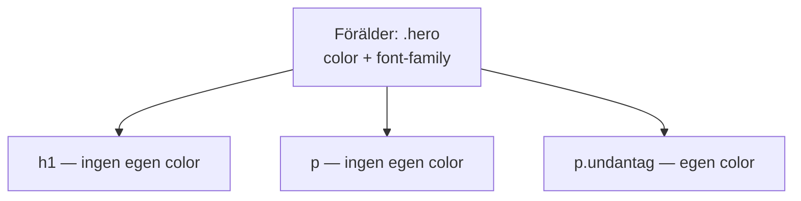
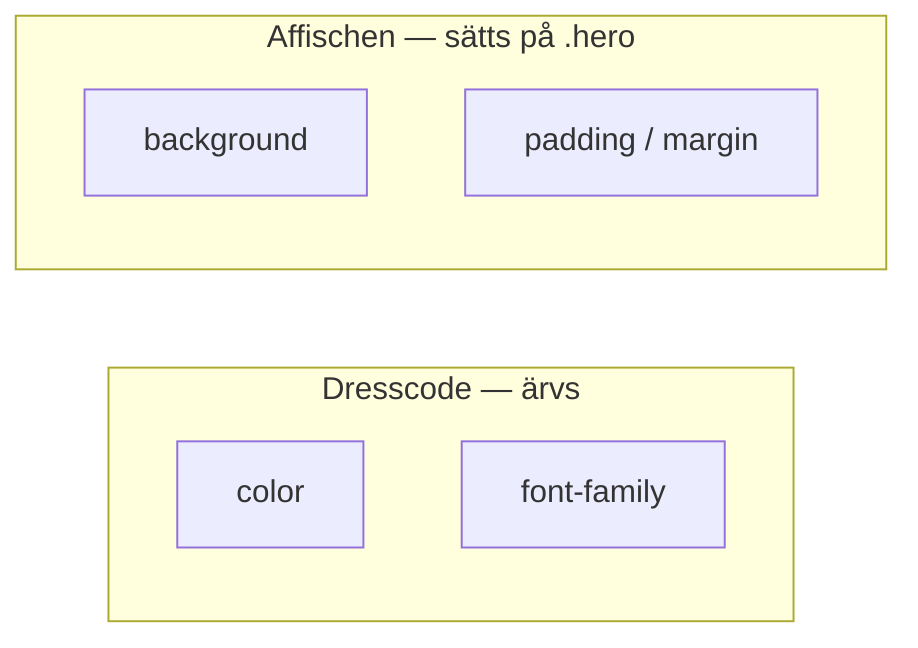
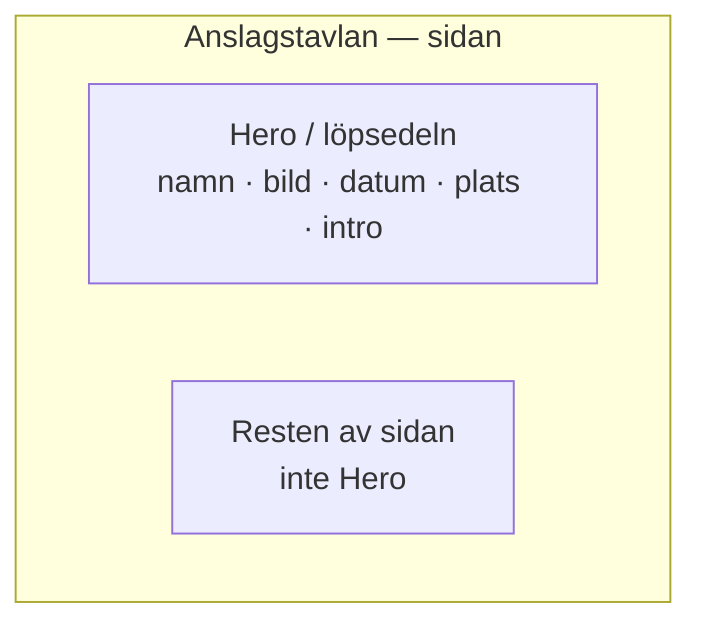
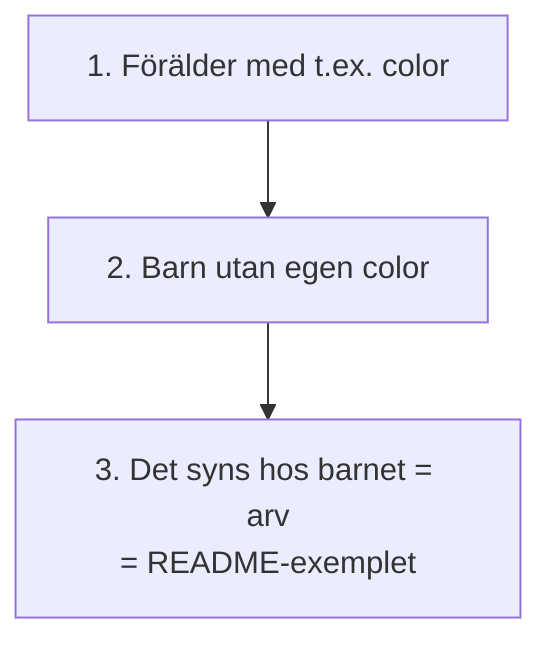

# 02 — Visuellt: arv och affischen

Samma dresscode- och affisch-metafor som i teoriguiden — nu som flöde. Ingen Flex/Grid-karta: förälder → barn + toppsektion räcker.

GitHub renderar diagrammen nedan automatiskt.

---

## Dresscoden rinner ner

**Vad diagrammet visar:** Barn utan egen regel får förälderns röst. Barnet med egen `color` bryter dresscoden medvetet.
**Kom ihåg / INTE:** `background` och `padding` på `.hero` stannar på affischen. De rinner inte in i barnen som textfärg gör.

**Målsvar (säg högt / skriv i README):** *"Color och font på föräldern syns hos barnen om barnen inte sätter egna värden."*

---

## Vad ärvs — och vad sitter på lådan?

Till vänster: policyn. Till höger: pappret. Blanda inte ihop — det är den vanligaste missen inför README-fråga 2.

---

## Affischen på tavlan

**Kom ihåg / INTE:** Hero är *ett papper* högst upp, inte hela tavlan. Semantisk `header` eller `section` så du kan peka i HTML.

---

## Metodkortet — tre steg

Utan steg 3 har du en definition. Examinationen vill ha *din* selektor.

---

## Checkpoint (privat)

Utan att titta på teoriguiden: säg vad som ärvs vs vad som sitter på affischen. Nämn Hero:s fem bitar. Jämför sen med diagrammen.

När kartan sitter: [03 — Övningar](./03-ovningar.md).
