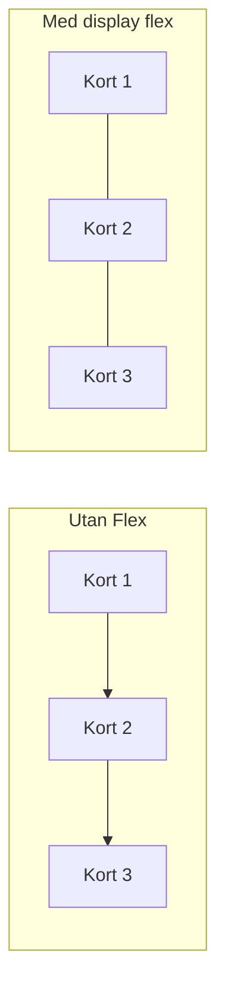
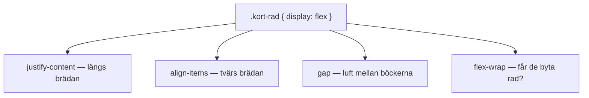
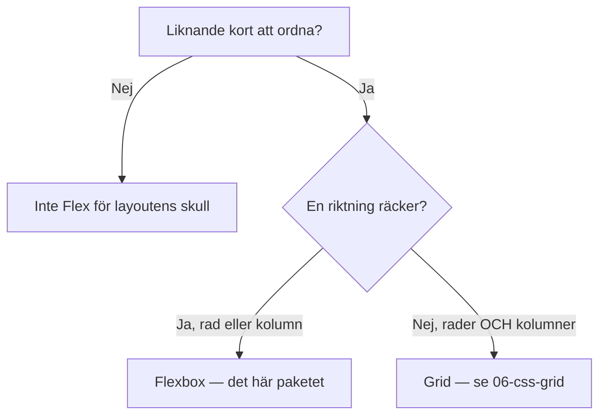

# 02 — Visuellt: en hyllbräda

Samma hyllbräda-metafor som i teoriguiden — nu som flöde. Ingen Grid-karta: en riktning + rattarna räcker.

GitHub renderar diagrammen nedan automatiskt.

---

## Stapel vs hylla



Till vänster: trave (vanliga block). Till höger: en bräda. `display: flex` sitter på **behållaren** runt korten.

**Kom ihåg / INTE:** Flex på själva kortet gör kortets *innehåll* till en mini-hylla — ofta fel ställe.

---

## Rattarna på brädan



**Målsvar (säg högt / skriv i README):** *"Justify längs huvudriktningen, align tvärs, gap mellan items, wrap om brädan tar slut."*

---

## Välja verktyg



**Kom ihåg / INTE:** Highlights-kort = Flex. Schema med tider *och* spår = inte idag.

---

## Feedback som pekar

```text
Dåligt:  "Ser bra ut!"
Bra:     "Saknar gap på .kort-rad — korten kuddra."
Bra:     "Korten är div; article passar en självständig rätt."
```

Utan pekning (tagg eller egenskap) går det inte att ändra något.

---

## Checkpoint (privat)

Utan att titta: säg vem som får `display: flex`, vad `gap` gör, och en bra feedback-mening. Jämför sen.

När kartan sitter: [03 — Övningar](./03-ovningar.md).
