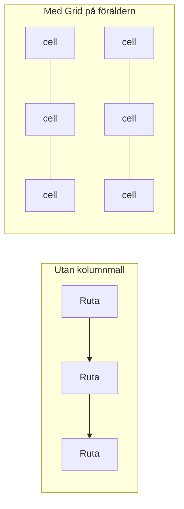
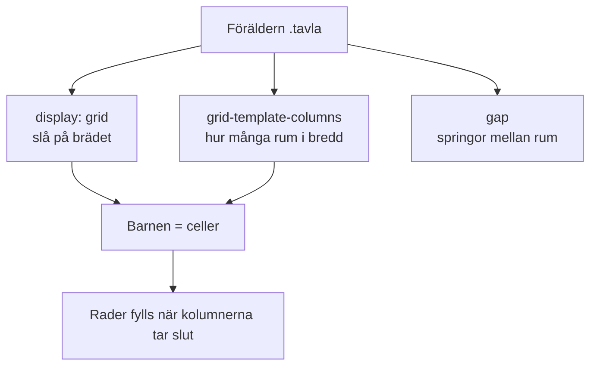
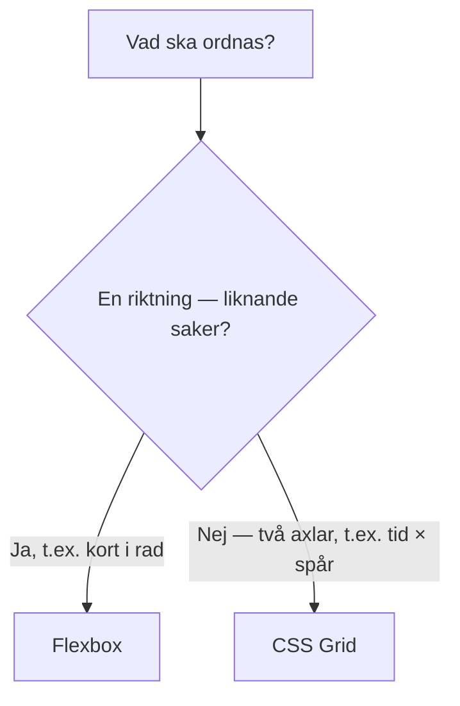

# 02 — Visuellt: CSS Grid

Samma schackbräde / kalkylark som i teoriguiden — nu som bild. Ingen meny-karta: föräldern, kolumnerna och valet Flex vs Grid räcker.

GitHub renderar diagrammen nedan automatiskt.

---

## Stapel vs bräde

Till vänster: en riktning — en kö. Till höger: rader *och* kolumner — ett kalkylark.

**Kom ihåg / INTE:** `display: grid` utan `grid-template-columns` ser ofta ut som vänster sida. Det är INTE att "Grid är trasigt".

---

## Rattarna på föräldern

**Vad diagrammet visar:** Brädet är containern. Pjäsen är barnet.
**Målsvar (säg högt / skriv i README):** *"Grid på föräldern. Kolumnmall + celler. Rader kommer när det blir fler barn än kolumner."*

---

## Flex eller Grid?

**Kom ihåg / INTE:** Inte "vilket är bäst". Examination 1: Highlights → Flex. Schema → Grid. README-fråga 3 = *ert* exempel.

**Målsvar (säg högt / skriv i README):** *"Kö → Flex. Schackbräde / kalkylark → Grid."*

---

## Checkpoint (privat)

Utan att titta på teoriguiden: säg de tre rattarna högt och varför Highlights inte ska bytas till Grid. Jämför sen.

När kartan sitter: [03 — Övningar](./03-ovningar.md).
