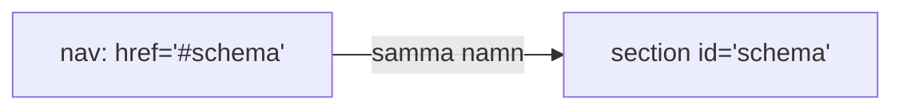
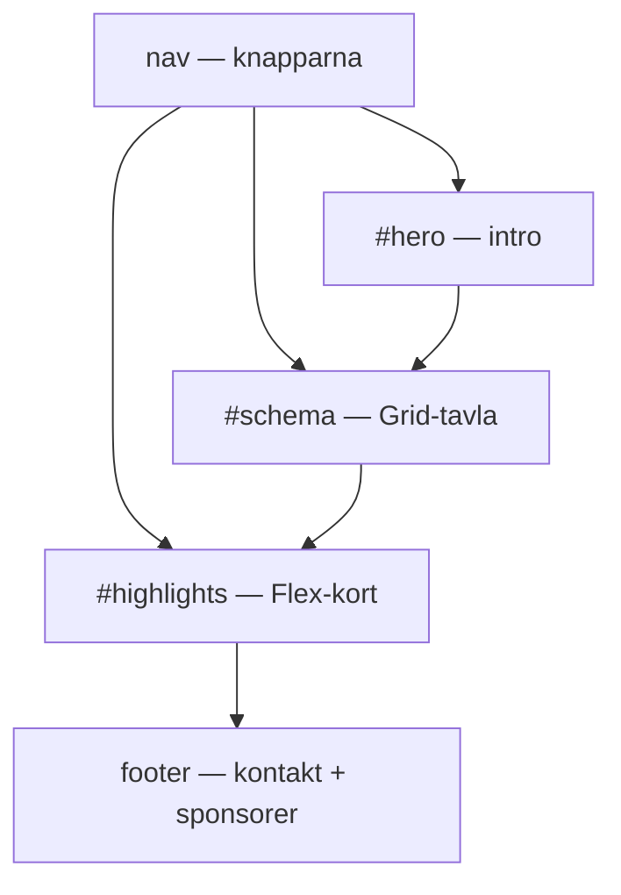
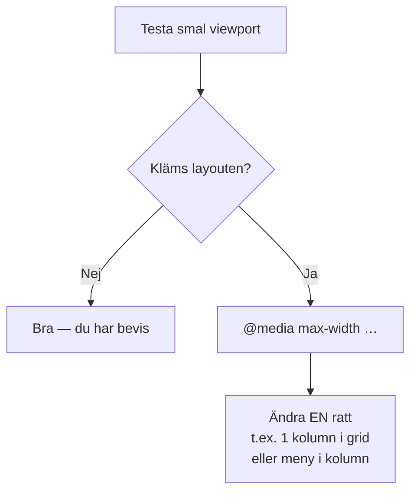

# 02 — Visuellt: hissknappar, sidfot och ihopvikt karta

Samma hiss- och kart-metaforer som i teoriguiden — nu som bild. Ingen Grid-genomgång: bara hopp, fot och när CSS byter regler.

GitHub renderar diagrammen nedan automatiskt.

---

## Knapp och skylt

**Vad diagrammet visar:** Hissknappen och våningsskylten.
**Kom ihåg / INTE:** Utan `#` eller med stavfel = död knapp. Det är INTE en ny HTML-fil.

**Målsvar (säg högt / skriv i README):** *"`href="#schema"` kräver `id="schema"` på samma sida."*

---

## Sidans våningar (Exam-sektioner)

**Kom ihåg:** Schema-layouten är Grid (syskonpaketet). Highlights är Flex. Nav *pekar* — den byter inte verktyg på sektionerna.

---

## Media query — skrivbord vs ryggsäck

**Metafor:** Utslagen karta på skrivbordet vs ihopvikt i ryggsäcken. Samma innehåll, andra vik.
**INTE:** En extra "mobilfil". Inte gissa utan att smalna fönstret.

**Målsvar (säg högt / skriv i README):** *"Media query = CSS som bara gäller vid vissa bredder. Testa viewport först, skriv sen andra reglerna."*

---

## Checkpoint (privat)

Utan att titta: säg hiss-matchen högt, vad footern måste innehålla, och metoden smalt → query → en ratt. Jämför sen.

När kartan sitter: [03 — Övningar](./03-ovningar.md).
